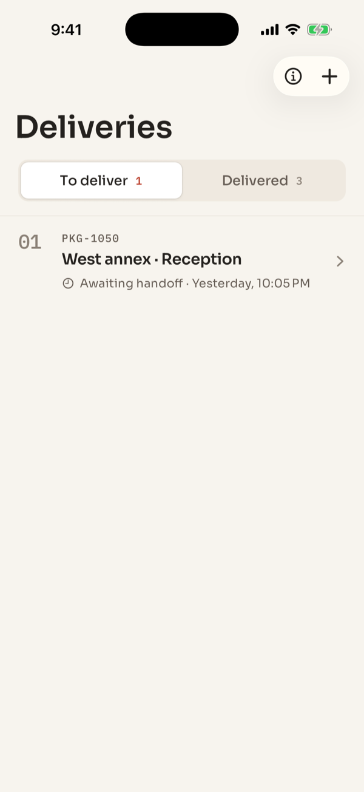
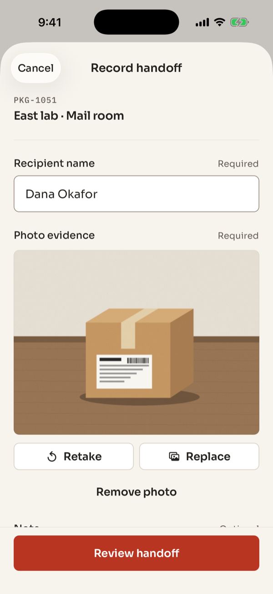
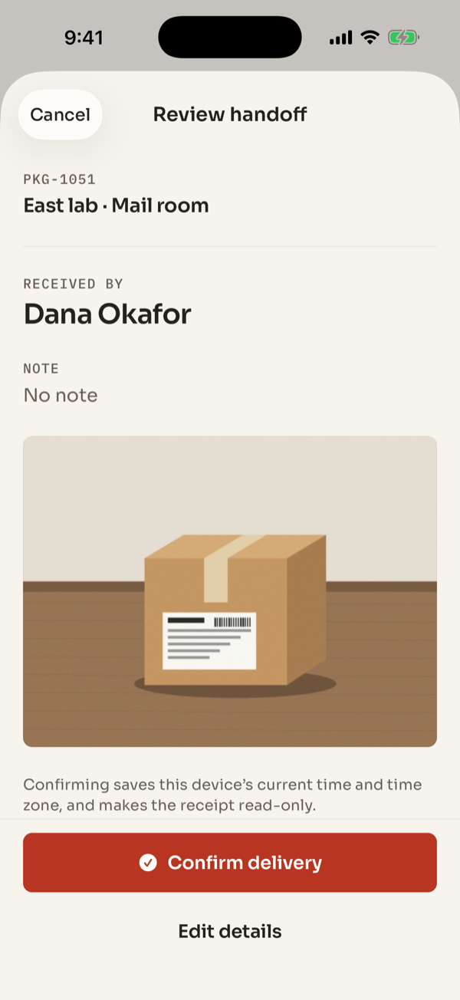
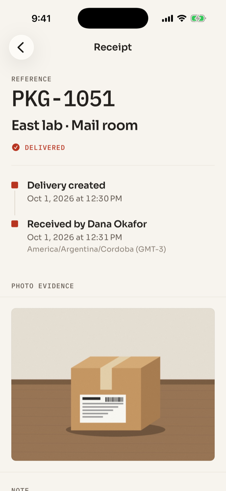

<div align="center">
  <p>
    <a align="center" href="https://www.folderit.net" target="_blank">
      
    </a>
  </p>

<br>

[mobile delivery receipts](https://github.com/FolderITDev/mobile-delivery-receipts)

<br>

[](LICENSE.md)


</div>

<details>
<summary><strong>Table of Contents</strong></summary>

- [Hello](#hello)
- [Overview](#overview)
  - [What this is](#what-this-is)
  - [What this is not](#what-this-is-not)
  - [Features](#features)
- [Screenshots](#screenshots)
- [Install](#install)
- [Quickstart](#quickstart)
- [Architecture](#architecture)
  - [Repository layout](#repository-layout)
  - [Engineering decisions](#engineering-decisions)
- [Tests and verification](#tests-and-verification)
- [Privacy and limitations](#privacy-and-limitations)
- [Documentation](#documentation)
- [FAQ](#faq)
- [License](#license)

</details>

## Hello

**[Folder IT](https://folderit.net) is a nearshore software development company that builds and scales AI-ready engineering teams for U.S. companies.** With 220+ software engineers, Folder IT delivers senior technical talent for organizations building AI software.

**Core capabilities:** Nearshore Staff Augmentation · AI-Ready Engineering Teams · AI Software Development · IoT Development · Web & Mobile Apps · Salesforce Consulting · ServiceNow Development

This repository is one example of that work: **Delivery Receipts**, an offline delivery record for iOS and Android built with React Native, Expo SDK 57 and strict TypeScript. A courier creates a pending delivery, records who received it with a photo, reviews the handoff and keeps a read-only receipt with the device time and time zone.

## Overview

### What this is

- A **runnable mobile reference app** that shows how one confirmation becomes one durable local receipt: no duplicate confirmations, no lost photo when a save fails, no partial records after a restart.
- An example of **local-first mobile engineering**: SQLite as the source of truth, versioned migrations, optimistic revisions and a serialized write queue.
- Original source code under the MIT license, with licensed bundled fonts and fictional test fixtures.

### What this is not

- Not a logistics platform, proof-of-delivery service or identity check. The timestamp comes from the device clock and is **not** server-verified or legally certified.
- Not connected to any backend. There are no accounts, analytics, cloud sync or model APIs.
- Not distributed through the App Store or Google Play. Store builds are outside the current scope.

### Features

- **Pending queue and delivered log.** Pending deliveries stay in route order (oldest request first); delivered ones show the latest handoff first.
- **Guided handoff.** Recipient name and photo are required; a note is optional. The review step shows exactly what will be saved before confirming.
- **Photo evidence.** Take a photo or pick one from the library. Images are resized to at most 1600 px, re-encoded as JPEG and copied into the app's documents directory before the record references them.
- **Idempotent confirmation.** A delivery can be confirmed once. A repeated confirmation returns a typed conflict instead of overwriting the receipt.
- **Read-only receipt** with reference, destination, recipient, photo, device time and the IANA time zone with its UTC offset (for example `America/Argentina/Cordoba (GMT-3)`).
- **Recoverable failures.** A failed save keeps the form and the selected photo so the user can retry.
- **Accessible by default.** Screen-reader labels, 50-point minimum touch targets, Dynamic Type and status conveyed in words, not only color. Light and dark palettes follow the system.

## Screenshots

<p align="center">
  
  
  
  
</p>

<sub>Captured on the iOS Simulator (iPhone 17 Pro, iOS 26.5) from a development build of this repository. Names and references are fictional; the package image is an original synthetic illustration used as test media.</sub>

## Install

Requirements:

- **Node.js 24 or later** and npm (the repo pins Node in `.node-version`).
- **Xcode** with an iOS Simulator, or **Android Studio** with an emulator, to run the native app. A physical device is needed to test the real camera.
- No API keys, accounts or environment variables.

Clone the repository and install the locked dependencies:

```bash
git clone https://github.com/FolderITDev/mobile-delivery-receipts.git
cd mobile-delivery-receipts
npm ci
```

This folder is standalone: it has its own dependencies and lockfile and imports nothing from other Folder IT repositories.

## Quickstart

Build and launch a native development build (the first build takes a few minutes):

```bash
npm run ios
```

```bash
npm run android
```

Later sessions only need the dev server, which serves on port `8081`:

```bash
npm start
```

A browser review build is also available with `npm run web`. It stores records in IndexedDB instead of SQLite and is meant for quick UI review, not as evidence of native behavior.

**Two-minute demo**

1. Tap **+** and create a delivery with a reference (for example `PKG-1051`) and a destination.
2. Open the pending delivery and choose **Record handoff**.
3. Enter the recipient's name and attach a photo with **Take photo** or **Library**.
4. Choose **Review handoff**, check the summary and tap **Confirm delivery**.
5. The delivery moves to **Delivered**. Close and reopen the app: the receipt is still there and can no longer be edited.

## Architecture

```text
┌────────────────────────────┐
│ src/app/   Expo Router     │  Thin route files: compose screens only
└─────────────┬──────────────┘
              ▼
┌────────────────────────────┐
│ src/features/  Screens     │  Forms, lists, receipt UI, explicit states
└─────────────┬──────────────┘
              ▼
┌────────────────────────────┐
│ src/data/store  Queue      │  Serialized writes; UI updates after success
└──────┬──────────────┬──────┘
       ▼              ▼
┌─────────────┐ ┌────────────────────────────┐
│ src/domain  │ │ src/data  Repositories     │
│ Pure rules  │ │ SQLite (native)            │
│ Validation  │ │ IndexedDB (web review)     │
└─────────────┘ │ Photo files in documents   │
                └────────────────────────────┘
```

A screen asks the store for a change. The store applies a pure domain transition to the latest committed record, writes it through the repository, and only then publishes the new state to React. If the write fails, the committed state stays intact and the error appears next to the action.

### Repository layout

| Path | What it holds |
|------|---------------|
| `src/app/` | Expo Router route entry points and the root layout. |
| `src/features/` | Delivery list, new delivery, handoff, review and receipt screens. |
| `src/domain/` | Pure transitions (`createDelivery`, `completeDelivery`) and runtime validation. |
| `src/data/` | SQLite and IndexedDB repositories, the mutation queue and durable photo storage. |
| `src/ui/`, `src/theme/` | Shared components and design tokens. |
| `src/hooks/`, `src/lib/` | Focused interaction helpers, formatting, dialogs and haptics. |
| `tests/` | Domain rules, formatting, migrations, restart and conflict tests. |
| `docs/` | Architecture decisions, AI-assisted engineering notes, publishing checklist and font licenses. |

### Engineering decisions

- **One aggregate per row.** Each delivery is stored as validated JSON in a SQLite row with an explicit revision. Updating a delivery is atomic and the schema stays small. A much larger catalog would justify normalized tables.
- **Optimistic revisions.** Every write states the revision it started from. A stale revision is rejected, not silently overwritten.
- **Versioned migrations.** A database written by a newer schema is rejected without a destructive reset.
- **Validation on read and write.** Corrupt or incomplete records are reported, never repaired by guessing. A completed delivery without recipient, photo, time or time zone cannot load.
- **Media before reference.** The photo is copied into app storage before the record points to it. Files that nothing references are cleaned after a 24-hour grace period, so a save still in flight never loses its photo.
- **Time zone captured with the moment.** The receipt formats the time in the zone where it was recorded, not where it is viewed.
- **No global state library.** Ephemeral state lives in screens and focused hooks; SQLite is the source of truth.

Full rationale: [`docs/architecture.md`](docs/architecture.md).

## Tests and verification

```bash
npm run check          # ESLint, strict TypeScript and the test suite
npm run format:check   # Prettier
npx expo-doctor        # Expo dependency and config checks
```

The suite runs with Node's built-in test runner and a real SQLite database (`node:sqlite`). It covers:

- A handoff requires a recipient and a photo and cannot be confirmed twice.
- Corrupt completed records cannot load.
- Pending deliveries keep route order; delivered ones show the latest first.
- Migration, durable restart and optimistic concurrency.
- A newer schema is rejected without a destructive reset.
- Malformed persisted data is surfaced, not overwritten.
- Receipt times and UTC offsets use the recorded zone, including half-hour zones and moments with seconds.

The same checks run in GitHub Actions on every push and pull request ([`.github/workflows/quality.yml`](.github/workflows/quality.yml)).

**Manual verification.** The full flow has been exercised on the iOS Simulator and on **physical iOS and Android devices**, including camera capture, permission granted and denied, airplane mode and restart. CI does not and cannot cover these checks.

## Privacy and limitations

- Records and photos are stored only on the device, inside the operating system sandbox, and the app does not encrypt them further. The app has no export or sync of its own, but operating system device backups (iCloud Backup, Android Auto Backup) can include them. Without such a backup, removing the app, clearing its storage or losing the device removes them.
- Photos are re-encoded before storage, which drops most embedded metadata. Do not treat this as a forensic guarantee.
- The device clock can be changed by the user. The receipt records what the device reported.
- The browser review build uses IndexedDB, whose quota and eviction rules depend on the browser.
- Camera permission is requested only when the user chooses **Take photo**. Picking from the library is always available as an alternative.

## Documentation

- [Architecture and decisions](docs/architecture.md)
- [Design system](DESIGN.md): Sora and IBM Plex Mono on a dispatch-label palette.
- [AGENTS.md](AGENTS.md): rules and workflow for contributors and AI coding agents.
- [AI-assisted engineering](docs/ai-engineering.md): how AI coding agents are used and reviewed.
- [Contributing](CONTRIBUTING.md) · [Security](SECURITY.md) · [Third-party notices](THIRD_PARTY_NOTICES.md)

## FAQ

<details>
<summary>What is Folder IT?</summary>

Folder IT is a nearshore software development and AI staff augmentation company. It builds and staffs AI Pods — small, senior engineering teams led by a Forward Deployed Engineer — for US-based companies.

</details>

<details>
<summary>What services does Folder IT provide?</summary>

Folder IT provides nearshore software engineering services for US companies:

- Artificial Intelligence Project Development (GenAI, LLMs, RAG systems, AI Agents, NLP, Computer Vision, MLOps)
- AI Pods and AI Solutions Builder
- IT Staff Augmentation & Outsourcing
- ServiceNow Implementation & Integration
- Salesforce Services
- Web Apps Development
- Mobile Apps Development
- Internet of Things Project Development
- Data Migration & Integration

</details>

<details>
<summary>What is a Folder IT AI Pod?</summary>

An AI Pod is a delivery model where one senior engineer (the Forward Deployed Engineer) owns a problem end to end, working with AI coding agents as a core part of the execution stack, backed by an internal AI Lab for architecture and technical review. It is not a project manager coordinating a team of developers.

</details>

<details>
<summary>Is this repository production-ready?</summary>

No. Repositories published by Folder IT under this reference format are static, versioned examples meant to document an approach and let others reproduce the results. They are not maintained as production dependencies. Delivery Receipts in particular has no export or sync of its own.

</details>

<details>
<summary>Can I use this code commercially?</summary>

Yes, under the license specified in this repository (see the [LICENSE](LICENSE.md) file). Bundled fonts keep their own licenses, listed in [THIRD_PARTY_NOTICES.md](THIRD_PARTY_NOTICES.md).

</details>

<details>
<summary>Does this repository call any external LLM or API?</summary>

No. The app makes no network requests at runtime: no backend, analytics, model API or remote fonts. During development, the app loads its JavaScript from the local Expo dev server.

</details>

<details>
<summary>Is the delivery time legally valid proof of delivery?</summary>

No. The time comes from the device clock, which the user can change, and it is not signed by a server. Delivery Receipts is a local handoff journal. A real proof-of-delivery system would need trusted time, authenticated users and tamper-evident storage.

</details>

<details>
<summary>Can I try it without a phone?</summary>

Yes. Run it on the iOS Simulator or an Android emulator and pick a photo from the library instead of using the camera. `npm run web` also opens a browser review build, although it uses IndexedDB instead of SQLite.

</details>

<details>
<summary>How can I contact Folder IT?</summary>

Through [folderit.net](https://folderit.net).

**Nearshore IT Staff Augmentation | Top LATAM Developers | Folder IT** — scale your engineering team and hire developers from Argentina. Same timezone, lower cost, 25+ years with US companies. [Talk to our team](https://folderit.net).

</details>

## License

Released under the [MIT License](LICENSE.md). Copyright (c) 2026 Folder IT.

<br>

<div align="center">
  <p>
<a href="https://www.linkedin.com/company/folderit"></a>&nbsp;&nbsp;&nbsp;&nbsp;&nbsp;<a href="https://www.instagram.com/folderit.social/"></a>&nbsp;&nbsp;&nbsp;&nbsp;&nbsp;<a href="https://x.com/folderit"></a>&nbsp;&nbsp;&nbsp;&nbsp;&nbsp;<a href="https://www.youtube.com/@folderit"></a>&nbsp;&nbsp;&nbsp;&nbsp;&nbsp;<a href="https://www.tiktok.com/@folder_it"></a>&nbsp;&nbsp;&nbsp;&nbsp;&nbsp;<a href="https://www.facebook.com/folderit.social"></a>
  </p>
</div>
